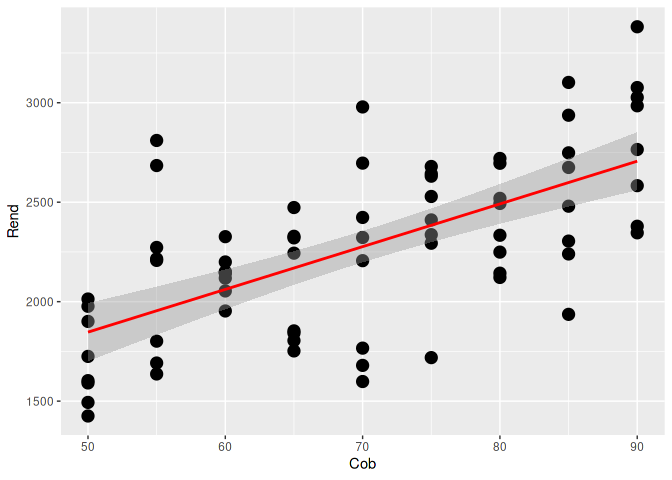

### 3. Confirme cuantas observaciones por nivel de cobertura existen

``` r
setwd("~/biome2/tp1")
datos  <- read.delim("datos_libreta_42515.txt", sep=" ")
table(datos$Cob)
```

    ## 
    ## 50 55 60 65 70 75 80 85 90 
    ##  8  8  8  8  8  8  8  8  8

### 4. Realice un grafico de dispersion de Y \~ X

``` r
plot(datos)
```

<!-- -->

### 5. Plantee el modelo en parametros

Regresion lineal

-   `beta0` = Ordenada al origen. Valor esperado de rendimiento cuando
    la cobertura = 0
-   `beta1` = Pendiente. Incremento en kg/ha por incremento de 1 unidad
    de cobertura

``` r
m <- lm(Rend~Cob, data=datos)
m
```

    ## 
    ## Call:
    ## lm(formula = Rend ~ Cob, data = datos)
    ## 
    ## Coefficients:
    ## (Intercept)          Cob  
    ##      772.90        21.48

### 6. Enuncie los supuestos del modelo

**Residuos: la diferencia entre el valor observado y el valor de la
recta de regresion.**

#### Linealidad

La relacion entre rendimiento y cobertura es lineal.

``` r
plot(datos)
```

<!-- -->

#### Independencia

Los residuos son independientes y no tienen correlacion.

#### Normalidad

Los residuos siguen una distribucion normal.

H0: los residuos siguen una distribucion normal

``` r
shapiro.test(m$residuals)
```

    ## 
    ##  Shapiro-Wilk normality test
    ## 
    ## data:  m$residuals
    ## W = 0.98003, p-value = 0.3088

No se rechaza H0.

#### Homocedasticidad

La varianza de los residuos no se incrementa con los valores ajustados
de la variable respuesta (rendimiento), es constante.

``` r
par(mfrow=c(2,2))
plot(m)
```

<!-- -->

Ver grafico de arriba a la izquierda, residuos vs valores ajustados por
la recta (valor de rendimiento estimado para dada cobertura)

### 7. Estime beta 0 y beta 1 del modelo. Calcule el intervalo de confianza para la pendiente e interpretelo.

``` r
m
```

    ## 
    ## Call:
    ## lm(formula = Rend ~ Cob, data = datos)
    ## 
    ## Coefficients:
    ## (Intercept)          Cob  
    ##      772.90        21.48

-   `beta0` = 772.90
-   `beta1` = 21.48

``` r
confint(m)
```

    ##                 2.5 %     97.5 %
    ## (Intercept) 335.82645 1209.97007
    ## Cob          15.34078   27.62143

## 8. Cual es el R2 del modelo? Interprete el valor. Vuelque el valor en la planilla

``` r
summary(m)
```

    ## 
    ## Call:
    ## lm(formula = Rend ~ Cob, data = datos)
    ## 
    ## Residuals:
    ##     Min      1Q  Median      3Q     Max 
    ## -678.04 -270.66   49.94  233.07  855.93 
    ## 
    ## Coefficients:
    ##             Estimate Std. Error t value Pr(>|t|)    
    ## (Intercept)  772.898    219.145   3.527 0.000747 ***
    ## Cob           21.481      3.079   6.977 1.37e-09 ***
    ## ---
    ## Signif. codes:  0 '***' 0.001 '**' 0.01 '*' 0.05 '.' 0.1 ' ' 1
    ## 
    ## Residual standard error: 337.3 on 70 degrees of freedom
    ## Multiple R-squared:  0.4102, Adjusted R-squared:  0.4018 
    ## F-statistic: 48.68 on 1 and 70 DF,  p-value: 1.374e-09

    Multiple R-squared:  0.4102, Adjusted R-squared:  0.4018 

------------------------------------------------------------------------

``` r
library(ggplot2)
ggplot(datos, aes(x=Cob, y=Rend)) + 
  geom_point(color="black", size = 4) + 
  geom_smooth(method=lm, color="red")
```

    ## `geom_smooth()` using formula 'y ~ x'

<!-- -->
